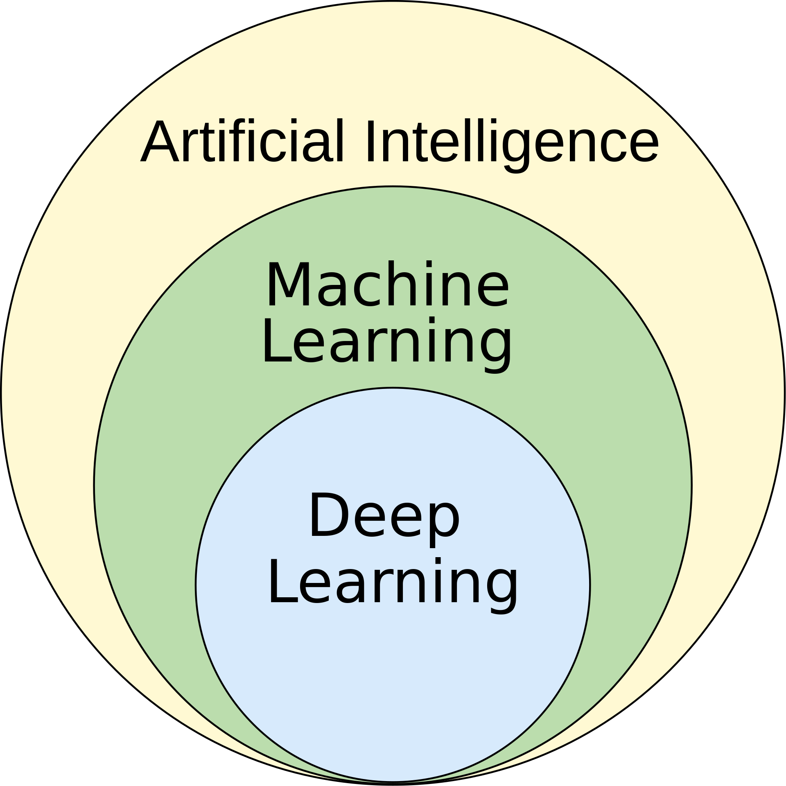

# ¿Qué es la Inteligencia Artificial? Una introducción histórica y conceptual

## Definiendo la inteligencia: la búsqueda por emular la mente humana

La Inteligencia Artificial (AI) es un campo amplio y ambicioso de la informática dedicado a crear sistemas capaces de realizar tareas que normalmente requieren inteligencia humana. Estas tareas incluyen el razonamiento, el aprendizaje, la resolución de problemas, la percepción, la comprensión del lenguaje e incluso la creatividad.

En esencia, la AI no trata solo de procesar datos, sino de **emular la cognición**. El objetivo final es construir máquinas que puedan pensar, aprender y adaptarse de maneras que sean indistinguibles de las capacidades humanas, o incluso superiores.

### El Test de Turing: un estándar para medir la inteligencia

En 1950, Alan Turing propuso una prueba simple pero poderosa para medir la capacidad de una máquina de exhibir un comportamiento inteligente equivalente al de un humano, o indistinguible de él. En el **Test de Turing**, un evaluador humano mantiene una conversación en lenguaje natural con un humano y con una máquina. Si el evaluador no puede distinguir de forma fiable a la máquina del humano, se dice que la máquina ha pasado la prueba.

## Una breve historia de la AI

El sueño de crear seres artificiales es antiguo, pero el camino científico de la AI comenzó a mediados del siglo XX.

- **1956: El Taller de Dartmouth — el nacimiento de un campo**: El término "Inteligencia Artificial" fue acuñado por John McCarthy en un taller de verano en el Dartmouth College. Este evento reunió a los padres fundadores de la AI y trazó la visión del campo. El optimismo inicial fue enorme: los pioneros predecían que las máquinas con inteligencia a nivel humano estarían listas en pocas décadas.

- **Los "inviernos de la AI": ciclos de entusiasmo y desilusión**: La historia de la AI ha estado marcada por períodos de intenso financiamiento y entusiasmo ("veranos de la AI") seguidos de "inviernos de la AI", donde el progreso se estancó y el financiamiento desapareció. Estos ciclos fueron causados frecuentemente por:
    - **Promesas exageradas**: Los primeros investigadores subestimaron la profunda dificultad de tareas como la visión por computadora y la comprensión del lenguaje natural.
    - **Límites computacionales**: El hardware de la época era insuficiente para manejar la complejidad de los modelos propuestos.
    - **La explosión combinatoria**: Muchos enfoques tempranos de AI se basaban en explorar vastos espacios de búsqueda de posibilidades, que rápidamente se volvían computacionalmente intratables.

- **2012-presente: La revolución del Deep Learning**: El "verano de la AI" actual fue encendido por la convergencia de tres factores clave:
    1.  **Big Data**: La disponibilidad de conjuntos de datos masivos para entrenar modelos complejos.
    2.  **Hardware potente**: El auge de las GPUs (Unidades de Procesamiento Gráfico) proporcionó el poder de cómputo paralelo necesario para el Deep Learning.
    3.  **Avances algorítmicos**: Innovaciones como el algoritmo de backpropagation y nuevas arquitecturas de redes neuronales (p. ej., AlexNet en 2012) desbloquearon un rendimiento sin precedentes.

Esta revolución cambió el paradigma dominante de los sistemas basados en reglas al **Machine Learning**, donde los sistemas aprenden directamente de los datos.

## Machine Learning vs. Inteligencia Artificial

Aunque se usan de forma intercambiable, el **Machine Learning (ML)** es una subdisciplina de la AI más fácil de definir. Se centra en construir sistemas que puedan **aprender de los datos**, identificar patrones y tomar decisiones con mínima intervención humana.

En lugar de programar explícitamente reglas para resolver un problema, un modelo de Machine Learning aprende su propio algoritmo analizando y encontrando patrones en los datos. Cuantos más datos se le proporcionen, mejor se vuelve el modelo.

Algunas definiciones clásicas:

> [Machine Learning es el] campo de estudio que da a las computadoras la capacidad de aprender sin ser explícitamente programadas.
>
> — Arthur Samuel, 1959

> Se dice que un programa de computadora aprende de la experiencia E con respecto a alguna clase de tareas T y una medida de rendimiento P si su rendimiento en las tareas T, medido por P, mejora con la experiencia E.
>
> — Tom Mitchell, 1997

### Deep Learning

El **Deep Learning** es una subdisciplina especializada del Machine Learning que usa **redes neuronales artificiales** con muchas capas (de ahí "profundo"). Al aprovechar arquitecturas profundas, estos modelos pueden aprender patrones complejos y jerárquicos a partir de grandes cantidades de datos. Esto ha llevado a avances en campos como la visión por computadora y el procesamiento de lenguaje natural.

## El espectro de la AI: de la inteligencia estrecha a la general

Los sistemas de AI pueden categorizarse según sus capacidades y su nivel de "consciencia".

### Weak AI (AI Estrecha)

La **Weak AI**, también conocida como **Artificial Narrow Intelligence (ANI)**, se refiere a sistemas de AI diseñados y entrenados para realizar una **tarea específica y bien definida**. Esta es la forma de AI que nos rodea hoy.

- **Características**:
    - **Específica de tarea**: Destaca en un trabajo (p. ej., jugar ajedrez, reconocer caras, filtrar spam).
    - **Sin consciencia ni autoconciencia**: Opera dentro de un rango predeterminado y no posee comprensión genuina ni consciencia.
    - **Basada en datos**: Su rendimiento está directamente ligado a la calidad y cantidad de los datos con los que fue entrenada.

- **Ejemplos**:
    - **Siri, Alexa y Google Assistant**: Asistentes de voz que comprenden y responden a un conjunto limitado de comandos.
    - **Motores de recomendación**: Algoritmos en Netflix o Amazon que sugieren contenido según tu historial de visualización.
    - **Coches autónomos**: Sistemas muy complejos, pero aún AI estrecha enfocada en la tarea de conducir.

### Strong AI (AI General o AGI)

La **Strong AI**, o **Artificial General Intelligence (AGI)**, es la inteligencia hipotética de una máquina que tiene la capacidad de comprender, aprender y aplicar su inteligencia para resolver **cualquier tarea intelectual que un ser humano pueda realizar**.

- **Características**:
    - **Cognición a nivel humano**: Posee la capacidad de razonar, planificar, aprender de la experiencia, pensar de forma abstracta y comprender ideas complejas.
    - **Consciencia y autoconciencia**: Una AGI real probablemente tendría alguna forma de consciencia y experiencia subjetiva (aunque este es un tema de intenso debate filosófico).
    - **Adaptabilidad**: Puede transferir conocimiento de un dominio a otro y aprender nuevas tareas sin ser reprogramada explícitamente.

**La AGI sigue siendo el santo grial de la investigación en AI y aún no existe.**

### Superinteligencia Artificial (ASI)

La **Artificial Superintelligence (ASI)** es una forma hipotética de AI que supera la inteligencia humana en prácticamente todos los ámbitos, incluida la creatividad científica, la sabiduría general y las habilidades sociales. El desarrollo de la ASI plantea profundas preguntas éticas y existenciales para el futuro de la humanidad.
