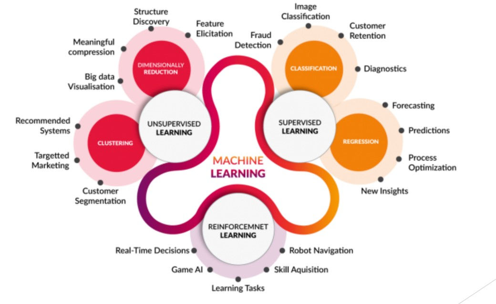
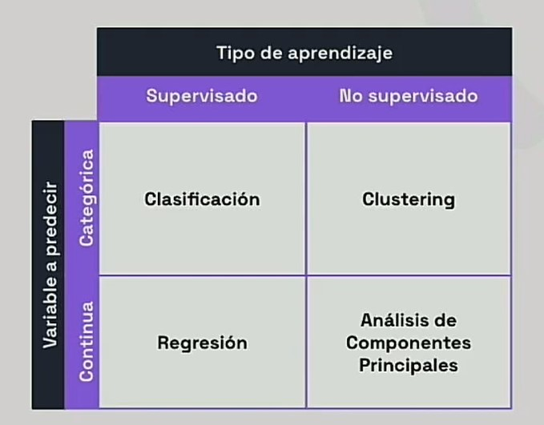
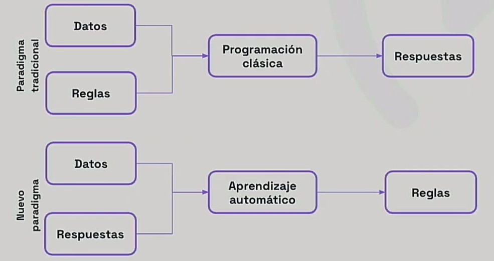
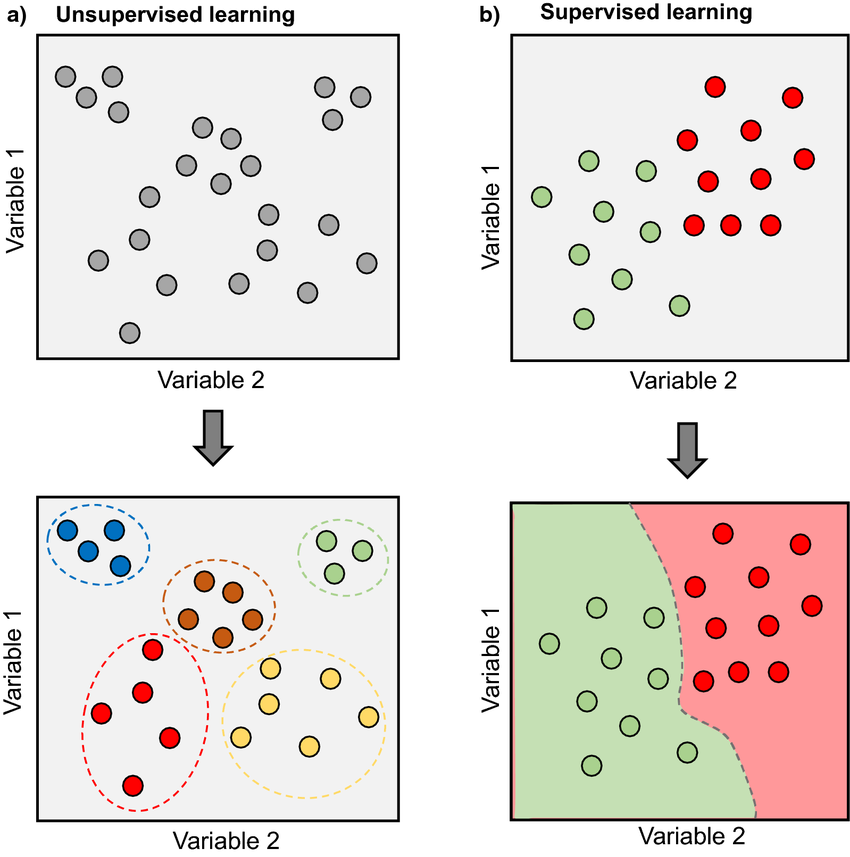

# Paradigmas del Machine Learning

El Machine Learning permite a los sistemas aprender de los datos, identificar patrones y tomar decisiones con mínima intervención humana. A diferencia de la programación tradicional, donde los programas se diseñan con reglas explícitas, el ML construye modelos aprendiendo de los datos.

> [Modelos para entender una realidad caótica | DotCSV](https://www.youtube.com/watch?v=Sb8XVheowVQ)

Un **modelo** es una descripción abstracta y articulada de una realidad. En Machine Learning, los modelos son aquello que **entrenamos** con datos usando un algoritmo de aprendizaje. El modelo aprende a ajustarse a una gran cantidad de ejemplos y luego se usa para predecir la respuesta correcta para nuevos datos de entrada no vistos.

La forma en que un modelo aprende está definida por su paradigma de aprendizaje, que se clasifica según el tipo de supervisión o retroalimentación que recibe durante el entrenamiento.

> [¿Qué es el aprendizaje supervisado y no supervisado? | DotCSV](https://www.youtube.com/watch?v=oT3arRRB2Cw)

## Aprendizaje supervisado (Supervised Learning)

En el aprendizaje supervisado, el conjunto de datos de entrenamiento está **etiquetado con la respuesta correcta**. El algoritmo de aprendizaje recibe un conjunto de datos de entrenamiento y, conociendo la respuesta correcta para cada ejemplo, infiere un modelo que genera esa respuesta.

### Clasificación (Classification)

Una tarea típica de aprendizaje supervisado es la **clasificación**. Consideremos un filtro de spam: un algoritmo puede aprender examinando muchos ejemplos de correos ya etiquetados como "spam" o "no spam". Puede inferir que ciertas palabras están casi siempre asociadas al spam, mientras que los correos de ciertos remitentes nunca son spam. Cuantos más ejemplos etiquetados reciba el algoritmo, mejor se vuelve filtrando el spam.

Otro ejemplo es el reconocimiento de dígitos escritos a mano, donde el algoritmo recibe imágenes de dígitos y debe clasificarlos del 0 al 9.

Tipos de clasificación:
- **Binaria**: La salida tiene dos clases (p. ej., spam/no spam, positivo/negativo).
- **Multiclase**: La salida tiene más de dos clases (p. ej., reconocimiento de dígitos, clasificación de imágenes).
- **Multietiqueta**: Una instancia puede tener asignadas múltiples etiquetas (p. ej., etiquetar música con géneros).

### Regresión (Regression)

En los problemas de **regresión**, el objetivo es predecir un **valor continuo**. Por ejemplo, predecir el precio de una casa según sus características (número de habitaciones, tamaño del jardín, ubicación, etc.). En este caso, en lugar de una etiqueta de clase, cada ejemplo está etiquetado con un valor numérico (el precio de la casa).

## Aprendizaje no supervisado (Unsupervised Learning)

En el aprendizaje no supervisado, el conjunto de datos de entrenamiento **no está etiquetado**. El objetivo es descubrir patrones ocultos o estructuras intrínsecas en los datos.

### Clustering (Agrupamiento)

El **clustering** consiste en agrupar puntos de datos en clusters basándose en su similitud. Un ejemplo es la segmentación de clientes, donde los clientes se agrupan en segmentos similares para adaptar mejor productos y servicios. Se usa en sistemas de recomendación, marketing y más.

### Minería de reglas de asociación (Association Rule Mining)

Mientras que el clustering agrupa instancias (como clientes), la **minería de reglas de asociación** descubre relaciones entre ítems. Por ejemplo, identificar que los clientes que compran pan también tienden a comprar mantequilla ("análisis de cesta de la compra").

### Reducción de dimensionalidad (Dimensionality Reduction)

La **reducción de dimensionalidad** busca reducir el número de variables (features) en un conjunto de datos. Esto es útil cuando se trabaja con datos de alta dimensionalidad donde algunas features pueden ser redundantes o irrelevantes. Puede reducir el tiempo de entrenamiento y mejorar la precisión del modelo. Una técnica común es el **Principal Component Analysis (PCA)**.

### Detección de anomalías (Anomaly Detection)

Esta tarea se centra en identificar puntos de datos o patrones inusuales que se desvían significativamente de la norma. Se usa en detección de fraudes, monitoreo de sistemas y seguridad para señalar datos que podrían indicar errores o ataques.

## Aprendizaje por refuerzo (Reinforcement Learning)

En el **aprendizaje por refuerzo**, un **agente** aprende interactuando con un **entorno**. El agente realiza acciones, y el entorno proporciona retroalimentación en forma de **recompensas** o **penalizaciones**. El objetivo del agente es aprender una **política** (una estrategia para elegir acciones) que maximice su recompensa acumulada a lo largo del tiempo.

Este paradigma se encuentra en robótica (p. ej., enseñar a un robot a caminar) y en juegos (p. ej., entrenar una AI para jugar ajedrez o Go).
