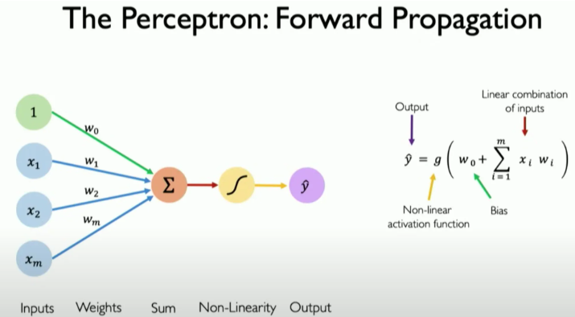
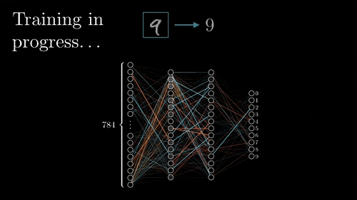
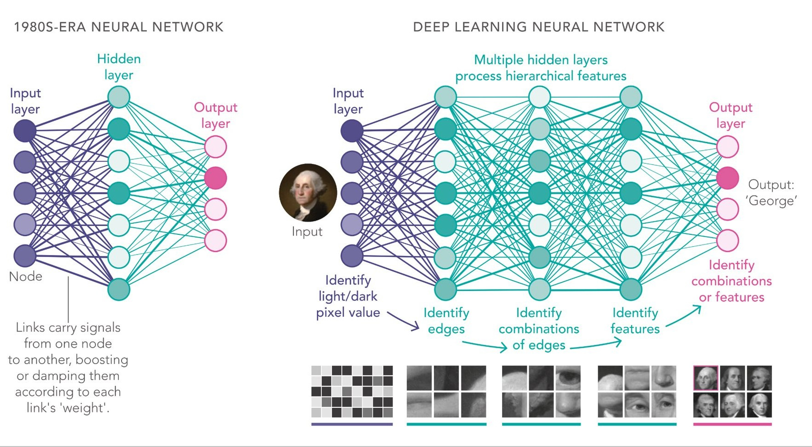

# Redes Neuronales y Deep Learning

## Hitos históricos

### Primeras bases (1943–2011)

- 1943: McCulloch y Pitts proponen el primer modelo matemático de una neurona.
- 1958: Frank Rosenblatt desarrolla el **Perceptrón**, considerado la primera red neuronal implementada.
- 1969: Minsky y Papert publican "Perceptrons", demostrando las limitaciones del perceptrón simple, lo que llevó al "invierno de la AI".
- 1986: Hinton, Rumelhart y Williams publican el algoritmo de ***backpropagation***, que **permite entrenar redes neuronales multicapa**.
- 1988: LeCun et al. presentan el primer modelo de red neuronal convolucional para el reconocimiento de caracteres escritos a mano (MNIST).
- 1997: Hochreiter & Schmidhuber introducen las **LSTMs** (Long Short-Term Memory), fundamentales para el procesamiento de secuencias y series temporales.

### El auge de la AI (2012-presente)

- Causas:
    - Mayor poder de cómputo (GPUs, TPUs)
    - Disponibilidad de enormes conjuntos de datos (Internet, Big Data)
    - Avances en algoritmos y arquitecturas de redes
    - Gran aumento del financiamiento e inversión industrial

- Principales hitos:
    - 2012: **AlexNet** (Krizhevsky, Sutskever y Hinton) reduce el error top-5 en **ImageNet** al 15,3% (desde el 26%), demostrando el poder de las CNNs y marcando el inicio del auge.
    - 2014: **DeepFace** de Facebook alcanza una precisión cercana a la humana (97,35%) en reconocimiento facial.
    - 2014: Ian Goodfellow introduce las **GANs** (Redes Generativas Antagónicas), revolucionando la generación de contenido.
    - 2015: **ResNet** de Microsoft Research introduce las conexiones residuales, permitiendo entrenar redes con más de 100 capas.
    - 2016: **AlphaGo** de DeepMind derrota al campeón mundial Lee Sedol usando redes neuronales profundas entrenadas con aprendizaje supervisado y por refuerzo con técnicas avanzadas de búsqueda de árbol Monte Carlo. ([Documental](https://www.youtube.com/watch?v=WXuK6gekU1Y)).
    - 2017: La arquitectura **Transformer** aparece con la publicación de "**Attention is all you need**" de Google Brain, transformando el procesamiento del lenguaje.
    - 2018: **BERT** de Google establece nuevos récords en comprensión del lenguaje natural.
    - 2020: **GPT-3** de OpenAI demuestra capacidades emergentes en modelos de lenguaje a gran escala.
    - 2021: Los **modelos de difusión** (DALL-E, GLIDE) comienzan a dominar la generación de imágenes realistas.
    - 2022: **ChatGPT** (GPT-3.5) de OpenAI populariza los asistentes conversacionales.
    - 2023: **GPT-4o** de OpenAI y la proliferación de modelos **multimodales** (texto, imagen, audio, vídeo).
    - 2024: Primeros modelos con capacidades de razonamiento avanzado (**OpenAI o1**).
    - 2025: **DeepSeek-R1** (*open-weights*) reduce el coste de los modelos de lenguaje con un rendimiento similar a o1.

## El Perceptrón: la neurona artificial

El perceptrón es la unidad fundamental de una red neuronal, inspirada en el funcionamiento básico de una neurona biológica. Es la forma más simple de una red neuronal y, en muchos sentidos, sentó las bases para redes más complejas.

> [¿Qué es una Red Neuronal? Parte 1: La Neurona | DotCSV](https://www.youtube.com/watch?v=MRIv2IwFTPg&list=PL-Ogd76BhmcC_E2RjgIIJZd1DQdYHcVf0&index=7)

> [ChatGPT está hecho de 100 millones de estos [El Perceptrón]](https://www.youtube.com/watch?v=l-9ALe3U-Fg)

### Estructura del Perceptrón

Un perceptrón toma varias entradas binarias y produce una única salida binaria. Funciona ponderando la importancia de cada entrada y, si la suma ponderada supera un cierto umbral, "se activa" (devuelve 1). De lo contrario, no lo hace (devuelve 0).

Un perceptrón consta de:
1.  **Entradas (Inputs)**: Valores numéricos que representan características de los datos.
2.  **Pesos (Weights)**: Valores que determinan la importancia de cada entrada. Un peso mayor significa que la entrada tiene más influencia en la salida.
3.  **Sesgo (Bias)**: Un parámetro adicional que permite ajustar el umbral de activación, haciendo el modelo más flexible.
4.  **Suma ponderada (Weighted Sum)**: Las entradas se multiplican por sus pesos correspondientes y se suman.
5.  **Función de activación (Activation Function)**: Esta función decide si la neurona debe activarse o no según la suma ponderada. En un perceptrón simple, es una función escalón.

### Limitaciones del Perceptrón simple

El perceptrón simple solo puede resolver problemas linealmente separables. Esto significa que puede clasificar datos que pueden separarse con una única línea recta. Puede aprender operaciones lógicas simples como AND y OR, pero es notoriamente incapaz con la operación XOR, que no es linealmente separable. Esta limitación llevó a un período de menor interés en las redes neuronales, conocido como el "invierno de la AI".

## Redes Neuronales Multicapa (MLP)

Para superar las limitaciones del perceptrón simple, los investigadores desarrollaron redes neuronales multicapa, también conocidas como Multilayer Perceptrons (MLPs). Estas redes consisten en múltiples capas de perceptrones, lo que les permite aprender patrones mucho más complejos.

> [3Blue1Brown - ¿Pero qué es una red neuronal?](https://www.youtube.com/watch?v=aircAruvnKk&list=PLZHQObOWTQDNU6R1_67000Dx_ZCJB-3pi)

### Estructura de una red neuronal multicapa

Una red neuronal multicapa contiene:
1.  **Capa de entrada (Input layer)**: Recibe los datos iniciales.
2.  **Capas ocultas (Hidden layers)**: Una o más capas que realizan transformaciones internas sobre los datos. Estas son la clave para aprender relaciones complejas y no lineales.
3.  **Capa de salida (Output layer)**: Produce el resultado final (p. ej., una clasificación o un valor de regresión).

### ¿Por qué necesitamos capas ocultas?

Las capas ocultas permiten a la red aprender características jerárquicas. Cada capa aprende a reconocer ciertos patrones en los datos, y las capas posteriores combinan esos patrones para aprender representaciones aún más complejas. Esto es lo que da al Deep Learning su poder.

## Funciones de activación (Activation Functions)

Las funciones de activación son un componente crucial de las redes neuronales. Introducen no linealidad en el modelo, lo que permite a la red aprender a partir de datos que no son linealmente separables. Sin ellas, una red neuronal sería simplemente un modelo lineal, sin importar cuántas capas tenga.

### Principales funciones de activación

1.  **Sigmoid**: Comprime cualquier entrada en un rango entre 0 y 1. Se usa frecuentemente en la capa de salida para problemas de clasificación binaria.
2.  **Tangente hiperbólica (tanh)**: Similar a la sigmoid, pero comprime los valores en un rango entre -1 y 1.
3.  **ReLU (Rectified Linear Unit)**: Es una de las funciones de activación más populares en el Deep Learning moderno. Es muy simple: devuelve la entrada si es positiva, y 0 en caso contrario. Es computacionalmente eficiente y ayuda a mitigar el problema del "vanishing gradient".
4.  **Softmax**: Se usa frecuentemente en la capa de salida para problemas de clasificación multiclase. Convierte un vector de puntuaciones brutas en una distribución de probabilidades, donde cada valor representa la probabilidad de que la entrada pertenezca a una clase determinada.

## Entrenamiento: **Gradient Descent** (Descenso del gradiente)

> [¿Qué es el Descenso del Gradiente? Algoritmo de Inteligencia Artificial | DotCSV](https://www.youtube.com/watch?v=A6FiCDoz8_4)

> [3Blue1Brown - Gradient descent, cómo aprenden las redes neuronales](https://www.youtube.com/watch?v=IHZwWFHWa-w&list=PLZHQObOWTQDNU6R1_67000Dx_ZCJB-3pi&index=2)

Entrenar una red neuronal es el proceso de encontrar los pesos y sesgos óptimos que permiten a la red hacer predicciones precisas. Esto se hace minimizando una **función de pérdida (loss function)**, que mide cuánto se alejan las predicciones del modelo de los valores correctos reales.

El algoritmo de optimización más común para entrenar redes neuronales es el **Gradient Descent**. Funciona ajustando iterativamente los parámetros del modelo (pesos y sesgos) en la dirección que reduce la pérdida.

1.  **Conceptos clave**:
    -   **Gradiente**: Un vector que apunta en la dirección del ascenso más pronunciado de la función de pérdida. Para minimizar la pérdida, nos movemos en la dirección opuesta al gradiente.
    -   **Tasa de aprendizaje (Learning rate)**: Un valor pequeño que controla el tamaño de los pasos que damos durante la optimización. Una tasa demasiado alta puede hacer que el modelo "salte" la solución óptima, mientras que una demasiado baja puede hacer que el entrenamiento sea muy lento.

2.  **Proceso**:
    -   El modelo hace una predicción (esto se llama el *forward pass*).
    -   La pérdida se calcula comparando la predicción con el valor real.
    -   Se calcula el gradiente de la pérdida con respecto a cada parámetro.
    -   Los parámetros se actualizan dando un pequeño paso en la dirección opuesta al gradiente.

## ***Backpropagation*** (Retropropagación)

Backpropagation es el algoritmo que nos permite entrenar de forma eficiente redes neuronales profundas y multicapa. Es el motor que impulsa el Deep Learning moderno.

> [¿Qué es una Red Neuronal? Parte 3: Backpropagation | DotCSV](https://www.youtube.com/watch?v=eNIqz_noix8&list=PL-Ogd76BhmcC_E2RjgIIJZd1DQdYHcVf0&index=10)

> [3Blue1Brown - Backpropagation](https://www.youtube.com/watch?v=Ilg3gGewQ5U&list=PLZHQObOWTQDNU6R1_67000Dx_ZCJB-3pi&index=3)

### ¿Cómo funciona?

1.  **Forward Pass**: La red calcula su salida para una entrada dada, pasando los datos desde la capa de entrada a través de las capas ocultas hasta la capa de salida.
2.  **Cálculo del error**: La salida se compara con el valor correcto para calcular el error o pérdida.
3.  **Backward Pass**: El error se propaga hacia atrás a través de la red, desde la capa de salida hasta la capa de entrada. Durante este proceso, el algoritmo calcula cuánto contribuyó cada peso y sesgo al error total.
4.  **Actualización de pesos**: Los pesos y sesgos se ajustan según su contribución al error, usando un algoritmo de optimización como el Gradient Descent.

La base matemática de backpropagation es la **regla de la cadena** del cálculo diferencial, que le permite calcular de forma eficiente los gradientes de todos los parámetros de la red.

## ***Deep Learning***

El *Deep Learning* se refiere a redes neuronales con muchas capas ocultas (de ahí "profundo"). Estas arquitecturas profundas permiten a los modelos aprender representaciones de datos a distintos niveles de abstracción.

### Ventajas del Deep Learning

1.  **Aprendizaje automático de características**: A diferencia del Machine Learning tradicional, donde la ingeniería de características suele ser un proceso manual y costoso en tiempo, los modelos de Deep Learning pueden aprender las características relevantes directamente de los datos.
2.  **Capacidad para modelar relaciones complejas**: El Deep Learning destaca en modelar relaciones complejas y no lineales, lo que lo hace especialmente potente para datos no estructurados como imágenes, texto y sonido.
3.  **Transferibilidad**: El conocimiento aprendido de una tarea a menudo puede transferirse a otra. Esto se conoce como **Transfer Learning**, y permite construir modelos potentes incluso con datos limitados.

### Arquitecturas populares de Deep Learning

1.  **Redes Neuronales Convolucionales (CNNs)**: Especializadas en procesar datos en forma de cuadrícula, como imágenes. Usan capas convolucionales para detectar patrones espaciales como bordes, texturas y formas.
2.  **Redes Neuronales Recurrentes (RNNs) y LSTM/GRU**: Diseñadas para datos secuenciales, como series temporales o texto. Tienen una forma de "memoria" que les permite mantener información sobre entradas anteriores en la secuencia.
3.  **Transformers**: Una arquitectura más moderna, también diseñada para datos secuenciales, que ha revolucionado el procesamiento del lenguaje natural. Usa un mecanismo llamado "atención" (attention) para ponderar la importancia de diferentes partes de los datos de entrada. Modelos como BERT y GPT están basados en la arquitectura Transformer.
4.  **Redes Generativas Antagónicas (GANs)**: Constan de dos redes, un generador y un discriminador, que compiten entre sí. Se usan para generar nuevos datos sintéticos similares a los datos de entrenamiento (p. ej., crear imágenes realistas).
5.  **Autoencoders**: Se usan para aprendizaje no supervisado, típicamente para reducción de dimensionalidad o detección de anomalías. Aprenden a comprimir datos en una representación más pequeña y luego reconstruirla a su forma original.
