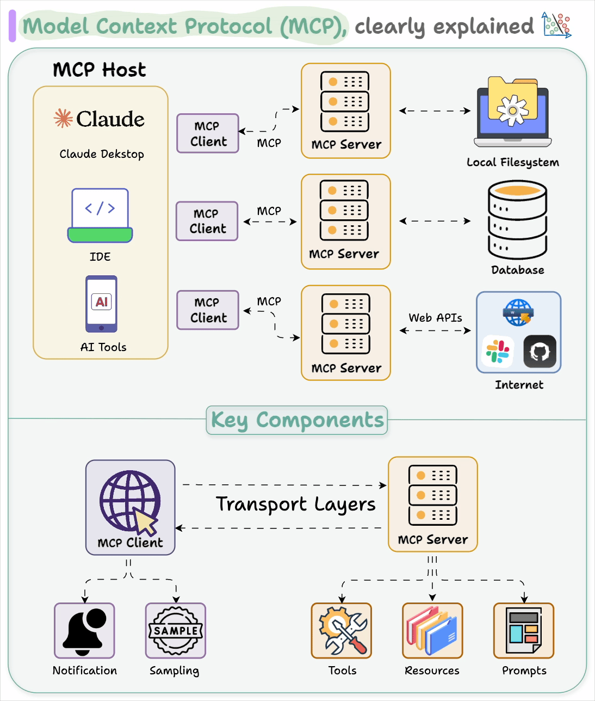

# La revolución de la AI Generativa

Mientras que la AI tradicional (o "AI predictiva") se centra en analizar datos existentes para hacer predicciones o clasificaciones, la **AI Generativa** trata de crear **contenido nuevo y original**. Esto marca un cambio fundamental: de comprender el mundo a crear dentro de él.

Los modelos generativos aprenden los patrones y la estructura subyacente de un conjunto de datos, y luego usan ese conocimiento para producir nuevos artefactos que son similares, pero distintos, a los datos de entrenamiento.

## Arquitecturas generativas clave

Varias arquitecturas potentes han impulsado el auge de la AI generativa.

### 1. Redes Generativas Antagónicas (GANs)

- **Concepto**: Las GANs consisten en dos redes neuronales, un **Generador** y un **Discriminador**, enfrentados en un juego competitivo.
    - El **Generador** crea datos falsos (p. ej., imágenes, texto).
    - El **Discriminador** intenta distinguir entre datos reales y los datos falsos creados por el generador.
- **El juego**: El objetivo del generador es engañar al discriminador, mientras que el objetivo del discriminador es mejorar en detectar falsificaciones. A través de este proceso antagónico, el generador se vuelve progresivamente mejor creando contenido realista.
- **Impacto**: Las GANs revolucionaron la generación de imágenes, permitiendo crear rostros fotorrealistas, arte y otro contenido visual.

### 2. Autoencoders Variacionales (VAEs)

- **Concepto**: Los VAEs son una extensión de los autoencoders. Aprenden a comprimir datos en un "espacio latente" estructurado y de menor dimensión, y luego reconstruirlos.
- **Proceso generativo**: Muestreando puntos de este espacio latente aprendido, un VAE puede generar nuevos datos. La estructura del espacio latente permite una interpolación suave entre diferentes puntos de datos (p. ej., transformar gradualmente una cara en otra).
- **Casos de uso**: Los VAEs se usan para generación de imágenes, aumento de datos y detección de anomalías.

### 3. Modelos de difusión (Diffusion Models)

- **Concepto**: Los modelos de difusión funcionan añadiendo ruido sistemáticamente a una imagen hasta convertirla en estática pura, y luego aprendiendo a revertir el proceso.
- **La inversión**: El modelo aprende a eliminar el ruido gradualmente, paso a paso, para recuperar una imagen limpia a partir de una entrada de ruido aleatorio. Controlando el proceso con prompts de texto u otras entradas, puede generar imágenes muy específicas y detalladas.
- **Impacto**: Los modelos de difusión son el estado del arte en generación de imágenes y potencian modelos como **DALL-E 2/3, Midjourney y Stable Diffusion**. Producen imágenes de asombrosa calidad y coherencia.

### 4. Transformers y Modelos de Lenguaje a Gran Escala (LLMs)

- **Concepto**: La **arquitectura Transformer**, introducida en el artículo de 2017 "Attention Is All You Need", revolucionó cómo procesamos datos secuenciales como el texto. Su innovación clave es el **mecanismo de auto-atención (self-attention)**, que permite al modelo ponderar la importancia de diferentes palabras en una secuencia al procesarla.
- **Modelos de Lenguaje a Gran Escala (LLMs)**: Al escalar los modelos Transformer a miles de millones de parámetros y entrenarlos con enormes cantidades de datos de texto de internet, los investigadores crearon LLMs como **GPT (Generative Pre-trained Transformer)**.
- **Cómo funcionan**: Los LLMs son fundamentalmente **predictores del siguiente token**. Dado un texto, predicen la siguiente palabra o carácter más probable. Haciendo esto repetidamente, pueden generar largos pasajes de texto coherentes.
- **Impacto**: Los LLMs han desbloqueado una gran variedad de aplicaciones, desde chatbots y creación de contenido hasta generación de código y descubrimiento científico. Representan un paso importante hacia una inteligencia artificial más general.

## Patrones prácticos de aplicación con LLMs

- Prompting e instrucciones de sistema: controla el comportamiento con roles claros, restricciones y ejemplos (few-shot).
- Llamada a funciones / uso de herramientas (Function calling / tool use): limita las salidas a esquemas JSON y llama a herramientas externas de forma segura.
- Retrieval-Augmented Generation (RAG): enriquece los prompts con contexto recuperado de datos privados (ver abajo).
- Guardarraíles y validación (Guardrails): validación de esquemas, filtros de contenido y controles de seguridad.

### Retrieval-Augmented Generation (RAG)

El RAG reduce las alucinaciones y permite el uso de conocimiento privado combinando recuperación con generación.

Pipeline básico:
- Ingestión: dividir documentos en fragmentos; limpiar y normalizar el texto.
- Embeddings: mapear fragmentos a vectores con un modelo de embeddings.
- Almacén vectorial (Vector store): indexar vectores en una base de datos de búsqueda por similitud.
- Recuperación (Retrieval): para una consulta, recuperar los top-k fragmentos relevantes; opcionalmente reordenar.
- Síntesis: construir un prompt con el contexto recuperado; generar la respuesta.

Notas y errores frecuentes:
- La estrategia de división en fragmentos importa (división semántica, solapamiento para preservar contexto).
- Evalúa la recuperación (precision@k, recall@k) y el QA de extremo a extremo (fidelidad y fundamentación de la respuesta).
- Añade citas: adjunta referencias de fuente a las respuestas para su verificabilidad.
- El caché y la deduplicación reducen costes y ruido.

Contrato mínimo para una tarea de QA con RAG:
- Entrada: consulta del usuario; filtros/metadatos opcionales.
- Salida: texto de respuesta; fuentes [{doc_id, span}], confianza.
- Errores: corpus vacío, sin fragmentos relevantes, límites de tasa.

Las bases de datos vectoriales suelen proporcionar: índices HNSW/IVF, filtros de metadatos, búsqueda híbrida (sparse+dense) y persistencia.

## El auge de la AI Agéntica (Agentic AI)

La última evolución en AI es el desarrollo de los **agentes de AI**. Un agente de AI es un sistema que va más allá de responder pasivamente a prompts y puede **razonar, planificar y ejecutar tareas de forma autónoma** para alcanzar un objetivo.

### Componentes principales de un agente de AI

1.  **LLM como "cerebro"**: Un potente Modelo de Lenguaje a Gran Escala sirve como motor central de razonamiento.
2.  **Planificación**: El agente descompone un objetivo de alto nivel en una secuencia de pasos más pequeños y accionables.
3.  **Uso de herramientas (Tool Use)**: El agente tiene acceso a un conjunto de herramientas (p. ej., búsqueda web, intérprete de código, otras APIs) que puede decidir usar para recopilar información o realizar acciones.
4.  **Memoria**: El agente mantiene una memoria de sus acciones, observaciones y autorreflexiones para aprender de su experiencia y adaptar su plan.

### Cómo funcionan los agentes: el framework ReAct

Un framework popular para construir agentes es **ReAct (Reason + Act)**. En este ciclo, el agente:
1.  **Razona** sobre el estado actual y el objetivo general.
2.  Decide una **Acción** a realizar (p. ej., usar una herramienta, responder al usuario).
3.  Hace una **Observación** basada en el resultado de su acción.
4.  Repite el ciclo, usando la nueva observación para informar su próximo paso de razonamiento.

Este bucle iterativo permite al agente adaptar su plan dinámicamente según nueva información, haciéndolo mucho más potente y flexible que un sistema simple de prompt-respuesta.

Otros patrones útiles:
- Plan-and-Execute: separar la planificación de alto nivel de la ejecución de bajo nivel para tareas largas.
- Auto-invocación estilo Toolformer: los modelos deciden cuándo llamar a herramientas.
- Razonamiento deliberado: asignar una fase de "pensamiento" separada antes de actuar (con o sin visibilidad).

### Model Context Protocol (MCP)

MCP es un protocolo abierto que estandariza cómo los LLMs se conectan a herramientas, fuentes de datos y acciones.

Ideas clave:
- Los servidores exponen capacidades (herramientas, prompts, recursos) mediante un contrato tipado.
- Los clientes (runtimes de agentes/editores) descubren e invocan esas capacidades.
- Ventajas: portabilidad de herramientas entre modelos, interacciones auditables, menos código de pegamento.

Componentes típicos:
- Registro de capacidades: listar las herramientas disponibles y sus esquemas.
- Canal de invocación: petición/respuesta para llamadas a herramientas con IO estructurado.
- Acceso a recursos: obtener documentos, archivos o bases de datos a través de una interfaz unificada.

Consejos de diseño:
- Mantén los esquemas de IO de las herramientas pequeños y validados; favorece las operaciones idempotentes.
- Proporciona herramientas sin estado cuando sea posible; externaliza el estado a un almacén.
- Registra todas las llamadas para observabilidad y auditorías de seguridad.

Ilustración:

### AI Gateways (Pasarelas de AI)

Un AI Gateway se sitúa entre tu aplicación y uno o más proveedores de modelos.

Características principales:
- Enrutamiento y fallbacks entre proveedores/modelos; pruebas A/B y canarios.
- Observabilidad: trazado, contabilidad de tokens/coste, latencia, errores.
- Seguridad: filtros de contenido, redacción de prompts, validación de salidas.
- Controles de política: límites de tasa, cuotas, manejo de PII.
- Gestión de prompts y plantillas; caché y deduplicación de respuestas.

Cuándo usarlo:
- Múltiples proveedores o modelos; optimización de coste/rendimiento; gobernanza centralizada.

### El futuro es agéntico

La AI agéntica representa un cambio de paradigma donde interactuamos con la AI no solo como una herramienta, sino como un **socio colaborativo**. Estos agentes pueden manejar tareas complejas y de múltiples pasos, desde planificar un viaje y reservar vuelos hasta realizar investigación científica y escribir software. El desarrollo de agentes más capaces y autónomos es un área clave de la investigación actual en AI y está destinado a redefinir cómo trabajamos e interactuamos con la tecnología.
