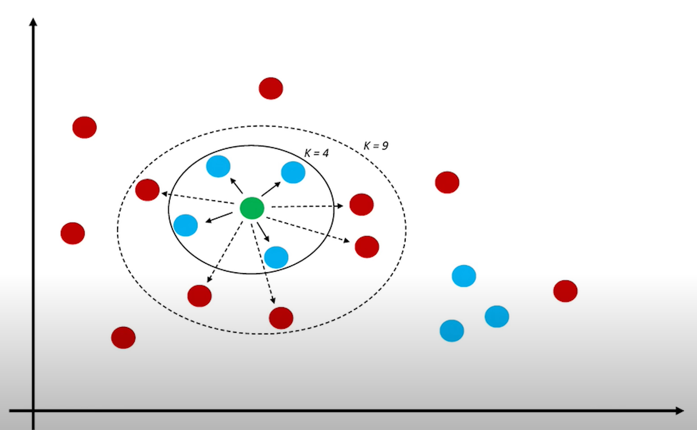
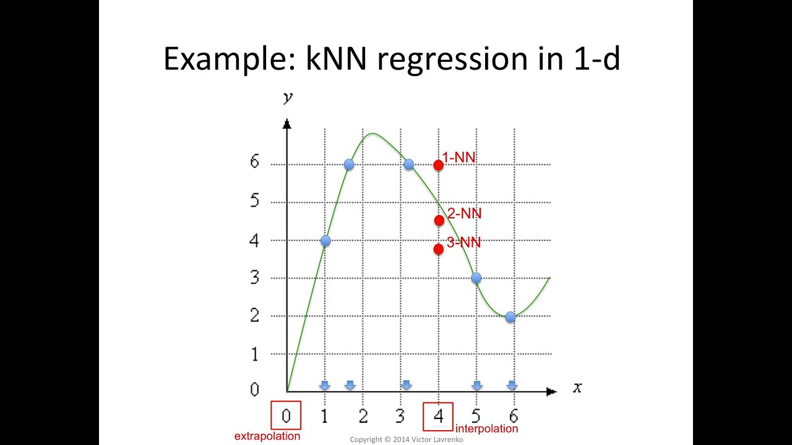

# K-Nearest Neighbors (KNN)

## Classification with KNN

K-Nearest Neighbors (KNN) is one of the most widely used machine learning algorithms in the industry due to its simplicity and effectiveness. KNN is a non-parametric algorithm, which means it makes no assumptions about the underlying data distribution. Instead of making assumptions, KNN learns directly from the data. KNN is a supervised learning algorithm that can be used for both classification and regression tasks.

Essentially, KNN works as follows: given a training dataset, for each sample to be predicted, KNN finds the closest training samples to it and assigns the most common classification label among them.

For example, in the following image, KNN with K=3 would assign the classification label "red triangle" to the green test point because among the 3 closest samples to it, the majority (two) are red triangles. However, if K=5, KNN would assign the classification label "blue square" to the test point.

In the following image, we can see how the decision surface of a KNN classifier is generated with different K values.

KNN is a **lazy learning** (or **instance-based learning**) algorithm, which means it **learns by remembering, not by summarizing**. Unlike traditional "eager learning" algorithms that extract patterns and fix internal parameter values during training, **KNN stores the entire training dataset and uses it as a "knowledge base"** for making predictions. This can be a disadvantage, as **every time a prediction needs to be made, the entire dataset must be consulted, which requires significant memory and processing resources**.

Thus, the "training" phase is very lightweight since it consists only of storing the training data. However, prediction is computationally expensive, as the distance from each test point to all training points must be calculated. Therefore, **KNN is a slow algorithm and is not suitable for large datasets**.

## Regression with KNN

In the case of regression, KNN assigns the average of the values of the closest training points to the test point. In the following image, we can see the value that would be assigned to the point x=4 for K=1, K=2, and K=3:

